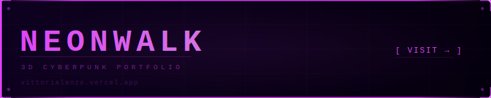

[;OSS+Contributor+%C2%B7+PrefectHQ+%C2%B7+sktime-mcp)](https://git.io/typing-svg)

**Vittoria Lanzo** &nbsp;·&nbsp; Cesena, Italy &nbsp;·&nbsp; OSS contributor

---

## 🏆 Achievements

<table>
<tr>
<td>

**🥈 Silver Medal — MEGA Hackathon 2026 (900+ participants)** 
Built [**Sestara**](https://sestara.lovable.app) — AI-powered study roadmap platform addressing SDGs 4 · 10 · 11 · 16

</td>
<td>

**🔀 OSS Contribution — PrefectHQ/prefect [#21004](https://github.com/PrefectHQ/prefect/pull/21004)** 
Merged: `--no-create-pool-if-not-found` flag for `prefect worker start`, orchestrated via multi-agent workflow

</td>
</tr>
<tr>
<td colspan="2">

**🔧 OSS Contributions (in progress) — sktime/sktime-mcp [#126](https://github.com/sktime/sktime-mcp/pull/126) · [#124](https://github.com/sktime/sktime-mcp/pull/124)** 
5 bugs patched in `RegistryInterface` (2 race conditions, 3 correctness errors) · double-checked locking · 100% branch coverage · 7.8× perf improvement (239ms → 31ms)

</td>
</tr>
<tr>
<td colspan="2">

**🤖 Core specialization:** multi-agent systems architecture · recursive self-iterating agent loops · prompt engineering (4 years)

</td>
</tr>
</table>

---

## 📦 Projects

<table>
<tr>
<td width="50%" valign="top">

### [Sestara](https://sestara.lovable.app)

AI-powered study roadmap platform. Generates personalized learning paths, flashcards, quizzes, and a study assistant in one place.

**Stack**

**SDGs:** 4 · 10 · 11 · 16 &nbsp; **🥈 MEGA Hackathon 2026 (900+ participants)**

</td>
<td width="50%" valign="top">

### [NeonWalk](https://vittorialanzo.vercel.app)

3D cyberpunk/Matrix-aesthetic personal portfolio. Real-time interactive environment built entirely in the browser.

**Stack**

&nbsp;

</td>
</tr>
</table>

---

## 🛠 Tech Stack

**Languages**

**Multi-agent Systems**

**Dev Environment**

**Creative**

**Infrastructure**

---

## 📊 GitHub Stats

&nbsp;&nbsp;

---

## 🌐 Portfolio

---

<picture>
  <source media="(prefers-color-scheme: dark)"  srcset="https://raw.githubusercontent.com/VittoriaLanzo/VittoriaLanzo/output/github-contribution-grid-snake-dark.svg">
  <source media="(prefers-color-scheme: light)" srcset="https://raw.githubusercontent.com/VittoriaLanzo/VittoriaLanzo/output/github-contribution-grid-snake.svg">
  
</picture>

&nbsp;

[vittoria3103.123@gmail.com](mailto:vittoria3103.123@gmail.com) &nbsp;·&nbsp; [vittorialanzo.vercel.app](https://vittorialanzo.vercel.app)

